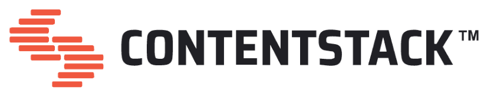

[](https://mseep.ai/app/darekrossman-contentstack-mcp)

<p align="center">
  
</p>

# Contentstack MCP Server
[](https://smithery.ai/server/@darekrossman/contentstack-mcp)

This Model Context Protocol (MCP) server integrates with Contentstack's Content Management API, enabling AI assistants like Claude to interact with your Contentstack CMS through a standardized protocol.

> **Note:** This is an early version of Contentstack MCP Server. See the [Roadmap](#roadmap) for upcoming improvements and planned features.

<a href="https://glama.ai/mcp/servers/@darekrossman/contentstack-mcp">
  
</a>

## Table of Contents
- [Features](#features)
- [Installation](#installation)
- [Development](#development)
- [Configuration](#configuration)
- [Integration with AI Assistants](#integration-with-ai-assistants)
- [Usage Examples](#usage-examples)
- [Roadmap](#roadmap)
- [License](#license)

## Features

### Available Resources
- **`content-types`**: List all content types (URI: `contentstack://content-types`)
- **`content-type`**: Get content type by UID (URI: `contentstack://content-type/{uid}`)
- **`entries`**: Get entries by content type (URI: `contentstack://entries/{content_type_uid}`)
- **`entry`**: Get specific entry (URI: `contentstack://entry/{content_type_uid}/{entry_uid}`)
- **`assets`**: List all assets (URI: `contentstack://assets`)

### Content Type Management
- Create, update, and delete content types
- Define schemas, options, field rules, and taxonomies
- Manage global fields

### Entry Management
- Create, update, and delete entries
- Publish and unpublish entries across environments
- Query entries with filtering, pagination, and sorting options

### Global Field Management
- Create and update global fields for reuse across content types
- Retrieve global fields with pagination options

### Content Workflows
- Guided content creation workflows
- Content analysis and insights
- Migration planning assistance

## Installation

### Prerequisites
- Node.js (v16.0.0 or higher)
- A Contentstack account
- API credentials (API Key and Management Token)

### NPM Installation
The easiest way to use this MCP server is via NPM:

```bash
# Install globally
npm install -g @drossman/contentstack-mcp

# Or use directly via npx
npx @drossman/contentstack-mcp
```

### Manual Installation

1. Clone the repository:
   ```bash
   git clone https://github.com/darekrossman/contentstack-mcp.git
   cd contentstack-mcp
   ```

2. Install dependencies:
   ```bash
   npm install
   ```

3. Set up environment variables:
   ```bash
   cp .env.example .env
   ```
   
   Edit the `.env` file with your Contentstack credentials:
   ```
   CONTENTSTACK_API_KEY=your_api_key_here
   CONTENTSTACK_MANAGEMENT_TOKEN=your_management_token_here
   # Optional: Specify branch if using branches
   CONTENTSTACK_BRANCH=your_branch_name
   ```

4. Build and start the server:
   ```bash
   npm run build
   npm start
   ```

### Installation via Smithery CLI

You can also install this MCP server using the [Smithery CLI](https://github.com/smithery-ai/cli):

```bash
npx @smithery/cli install contentstack-mcp --client claude
```

See the [Smithery CLI documentation](https://github.com/smithery-ai/cli) for more details and advanced usage.

## Development

### Setup for Development
For development, you can use:
```bash
npm run dev
```

This starts the server using `ts-node` for a faster development cycle.

### Code Quality

This project uses [Biome.js](https://biomejs.dev/) for linting and formatting. It provides a consistent code style and helps catch potential issues early.

#### Available Commands

- **Lint Code**:
  ```bash
  npm run lint
  ```

- **Lint and Fix**:
  ```bash
  npm run lint:fix
  ```

- **Format Code**:
  ```bash
  npm run format
  ```

- **Format and Fix**:
  ```bash
  npm run format:fix
  ```

## Configuration

### Authentication

This server requires authentication with Contentstack's API:

**Management Token (Required)**:
- Stack-level token with predefined permissions
- Set via `CONTENTSTACK_MANAGEMENT_TOKEN` environment variable
- Generate from Contentstack dashboard: Settings > Tokens > Management Tokens

**API Key (Required)**:
- Stack API key for authentication
- Set via `CONTENTSTACK_API_KEY` environment variable

### Branch Support

If your Contentstack account uses branches, you can specify a branch:

```
CONTENTSTACK_BRANCH=develop
```

## Integration with AI Assistants

### Claude for Desktop

To use this server with Claude for Desktop:

1. Edit your Claude for Desktop configuration file:
   - Mac: `~/Library/Application Support/Claude/claude_desktop_config.json`
   - Windows: `%APPDATA%\Claude\claude_desktop_config.json`

2. Add this server to the `mcpServers` section:
   ```json
   {
     "mcpServers": {
       "contentstack": {
         "command": "npx",
         "args": ["-y", "@drossman/contentstack-mcp"],
         "env": {
           "CONTENTSTACK_API_KEY": "your_api_key_here",
           "CONTENTSTACK_MANAGEMENT_TOKEN": "your_management_token_here"
         }
       }
     }
   }
   ```

3. Restart Claude for Desktop

### Cursor

To use this server with Cursor, add the Contentstack MCP server configuration:
```json
{
   "mcpServers": {
      "contentstack": {
      "command": "npx",
      "args": ["-y", "@drossman/contentstack-mcp"],
      "env": {
         "CONTENTSTACK_API_KEY": "your_api_key_here",
         "CONTENTSTACK_MANAGEMENT_TOKEN": "your_management_token_here",
      }
      }
   }
}
```

### Install with Smithery

You can also install this MCP server using the [Smithery CLI](https://github.com/smithery-ai/cli) using your client of choice:

```bash
npx -y @smithery/cli install @drossman/contentstack-mcp --client claude
```

#### Available clients include:

- claude
- cline
- windsurf
- roocode
- witsy
- enconvo
- cursor
- vscode
- vscode-insiders
- boltai
- amazon-bedrock
- amazonq

See the [Smithery CLI documentation](https://github.com/smithery-ai/cli) for more details and advanced usage.

## Roadmap

- [ ] **Enhanced AI Contextual Understanding**: Improve context provisioning for complex queries
- [ ] **Advanced Querying & Filtering**: Support filtering by multiple criteria and custom fields
- [ ] **Workflow & Publishing Automation**: Enable AI-driven content workflow actions
- [ ] **Asset Management Enhancements**: Add direct asset manipulation capabilities
- [ ] **Bulk Operations Support**: Implement batch operations for entries and assets
- [ ] **Improved Error Handling & AI Feedback**: Refine error messages for AI consumption
- [ ] **User-Specific Context & Permissions**: Tailor actions based on user permissions
- [ ] **Extensibility for Custom Tools**: Create an extension framework
- [ ] **Real-time Event Handling**: Add webhook support for reactive AI behaviors
- [ ] **Comprehensive Documentation**: Develop detailed guides for AI interaction

## Shoutout

Special thanks to [Ivo Toby](https://github.com/ivo-toby). This project and its author are heavily inspired by his work in this space.

## License

MIT

---

**Disclaimer:** This project is not affiliated with, endorsed by, or supported by Contentstack. It is an independent open-source project designed to work with the Contentstack API.
